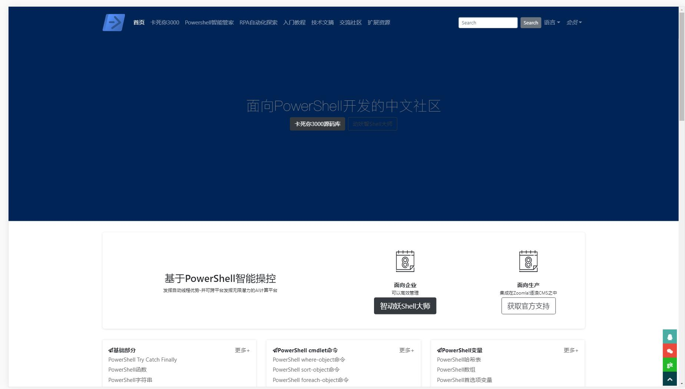
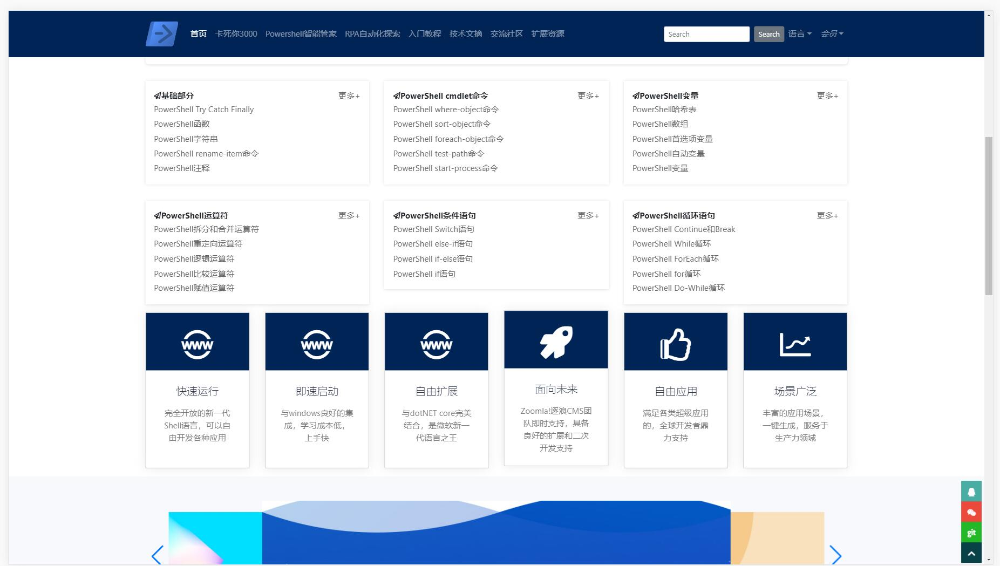
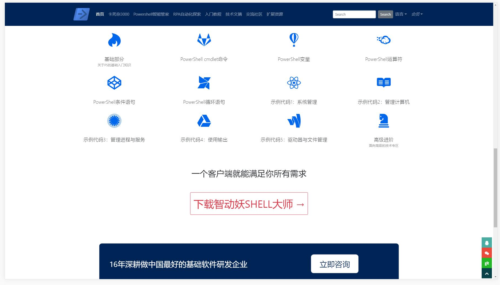
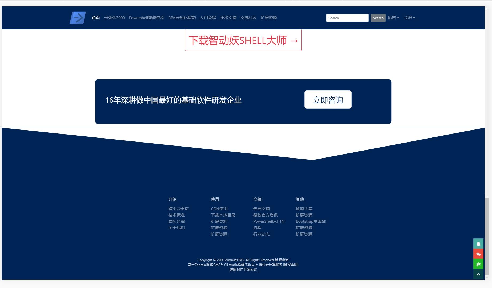
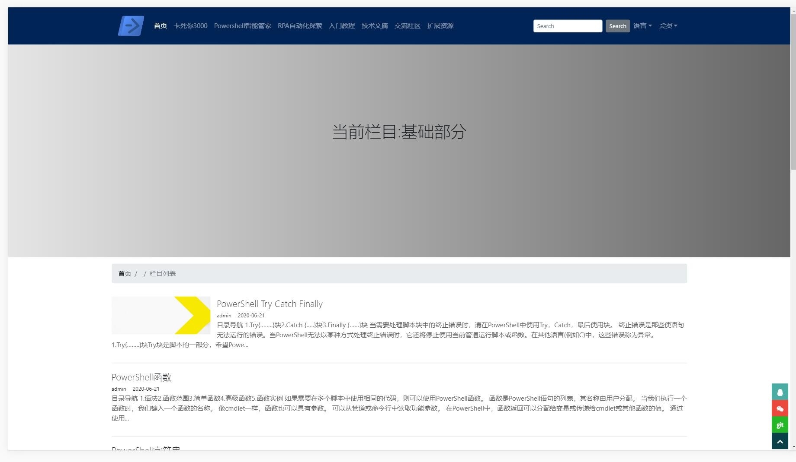
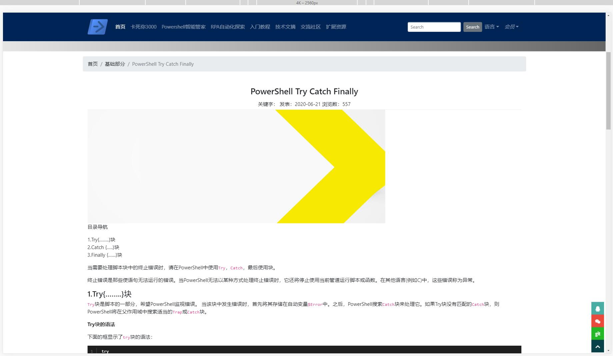
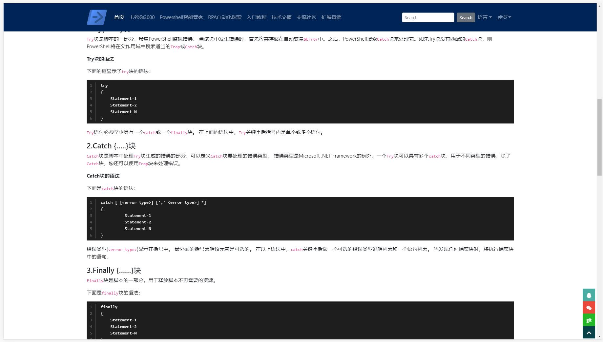
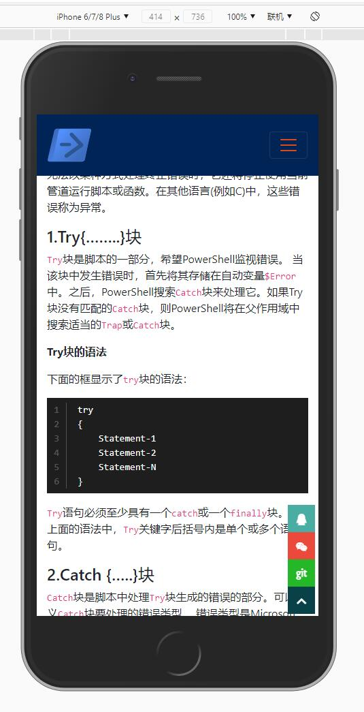

[目录]

<!-- TOC -->

- [Zoomla!逐浪CMS卓越出品](#zoomla逐浪cms卓越出品)
    - [Zoomla-Cli-Studio开发栈001：深蓝门户](#zoomla-cli-studio开发栈001深蓝门户)
    - [使用说明](#使用说明)
    - [开放性说明](#开放性说明)
    - [命令指引](#命令指引)
        - [Project setup](#project-setup)
        - [Compiles and hot-reloads for development](#compiles-and-hot-reloads-for-development)
        - [Compiles and minifies for production](#compiles-and-minifies-for-production)
        - [Lints and fixes files](#lints-and-fixes-files)
        - [Customize configuration](#customize-configuration)
    - [效果预览](#效果预览)

<!-- /TOC -->


# Zoomla!逐浪CMS卓越出品

## Zoomla-Cli-Studio开发栈001：深蓝门户
***一种在网站后台就能直接获取git和npm源码、一键配置接口数据并直接生成智能门户的解决方案-源自18年技术积累、alexa中文排名第一的Zoomla!逐浪CMS团队！***

Zoomla!逐浪CMS：中文业界alexa排名第一的CMS系统|专注.net与windows平台企业级研发，集成内容管理、webfont、商城、店铺、黄页、教育、考试、3D、三维全景、混合现实、CRM、ERP、OA、论坛、贴吧等为一体，打造国内高端的CMS产品典范。

官网：www.z01.com

免费下载：www.z01.com/pub

视频教程：www.z01.com/mtv

模板资源：www.z01.com/mb

逐浪字库： http://f.ziti163.com

zico中文图标库：http://ico.z01.com

QQ交流群号：
[](https://jq.qq.com/?_wv=1027&k=5qIayyX)  [](https://jq.qq.com/?_wv=1027&k=5Ephzpq)   [](https://jq.qq.com/?_wv=1027&k=50a28BK) 


官方QQ客服：
[](http://wpa.qq.com/msgrd?v=3&uin=745151353&site=qq&menu=yes)  [](http://wpa.qq.com/msgrd?v=3&uin=1799661890&site=qq&menu=yes) 


## 使用说明

- 1.你可以直接下载本源码，然后执行`yarn install`或`npm install`，然后增加相应Zoomla!逐浪CMS接口开发。
- 2.您可以更加方便的进行NODE开发，现在只要部署或进入Zoomla!逐浪CMS后台，点击移动-Zoomla Cli studio就能进行全生态的站点发布，根据名称从云端获取本项目名，进行`yarn install`或`npm install`,并进行各种配置、发布，完全智能的体验，十倍提升开发效率，一键接入接口，就在 www.z01.com/Build
- 3.你可以直接在Zoomla Cli studio管理界面，对安装包和服务进行管理，自由发布，从而取代传统门户，进入全新的第三代门户网站开发时代。


## 开放性说明
本项目基于Zoomla!逐浪CMS接口开发，集成门户、商城、OA、办公、ERP、微信与小程序管理 ，用户可以自由部署、自由二次开发，内置千套模板，完全免费开源，数据接口也全面开放。

有道是：

- 建网站,选逐浪。
- 易上手,功能棒。
- 质量好,服务善。
- 高性能,最划算。


## 命令指引

### Project setup
```
yarn install
```

### Compiles and hot-reloads for development
```
yarn serve
```

### Compiles and minifies for production
```
yarn build
```

### Lints and fixes files
```
yarn lint
```

### Customize configuration
See [Configuration Reference](https://cli.vuejs.org/config/).


## 效果预览







